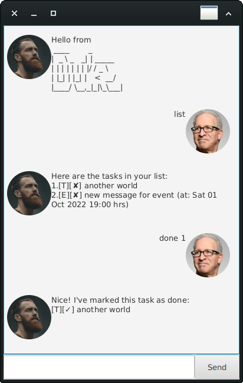

# User Guide



## Features

| Commands                                                                   | Usage                                                           |
| -------------------------------------------------------------------------- | --------------------------------------------------------------- |
| `todo` [message]                                                           | Adds a todo with the message to task list                       |
| `deadline` [message] /by [DD/MM/YYYY HHMM]                                 | Adds a deadline with a message and deadline to the task list    |
| `event` [message] /at [DD/MM/YYYY HHMM]                                    | Adds an event with a message and an event time to the task list |
| `update` [index] [-m / -t flag] [message] [time (for events or deadlines)] | Updates a task at index with other given parameters             |
| `list`                                                                     | List all tasks in the task list                                 |
| `done` [index]                                                             | Marks task at index as done                                     |
| `delete` [index]                                                           | Removes task at index from the task list                        |
| `find` [keyword]                                                           | Finds a task matching specific keywords in the list             |
| `bye`                                                                      | Exits the application and saves your tasks                      |

## Usage

### `todo`

Adds a new todo task to the list

#### Usage:

```
> todo Complete homework

Got it! I've added this task:
[T][✘] Complete homework
Now you have X tasks in the list
```

Where X should reflect the actual number of tasks you currently have in your task list

### `deadline`

Adds a deadline with a message and deadline to the task list

#### Usage:

```
> deadline Assignment 1 /by 20/10/2021 1900

Got it! I've added this task:
[D][✘] Assignment 1 (by: Wed 20 Oct 2021 19:00 hrs)
Now you have X tasks in the list
```

Where X should reflect the actual number of tasks you currently have in your task list

### `event`

Adds an event with a message and an event time to the task list

#### Usage:

```
> event Hackathon /at 21/02/2021 1900

Got it! I've added this task:
[E][✘] Hackathon (at: Sun 21 Feb 2021 19:00 hrs)
Now you have X tasks in the list
```

Where X should reflect the actual number of tasks you currently have in your task list

### `list`

List all tasks currently in the task list, listed with their index

#### Usage:

```
format of task:
[index]. [type][✘/✔] [message]
```

```
> list

Here are the tasks in your list:
1. [T][✘] Complete homework
2. [D][✘] Assignment 1 (by: Wed 20 Oct 2021 19:00 hrs)
3. [E][✘] Hackathon (at: Sun 21 Feb 2021 19:00 hrs)
```

### `update`

Updates a task at index with other given parameters

#### Optional Flags:

Flags can be used to change only a specific part of your Event or Deadline

| Flag | Functionality                            |
| ---- | ---------------------------------------- |
| `-m` | Amend the message of an Event / Deadline |
| `-t` | Amend the time of an Event / Deadline    |

#### Usage:

```
Command format:
update [index] [optional flag: -m / -t] [message / message and date]
```

```
> list

Here are the tasks in your list:
1. [T][✘] Complete homework
2. [D][✘] Assignment 1 (by: Wed 20 Oct 2021 19:00 hrs)
3. [E][✘] Hackathon (at: Sun 21 Feb 2021 19:00 hrs)

> update 1 Hello World

Got it! Task has been amended to:
[T][✘] Hello World

> update 2 -m Assignment 1 Part A

Got it! Task has been amended to:
[D][✘] Assignment 1 Part A (by: Wed 20 Oct 2021 19:00 hrs)

> update 3 -t 20/02/2021 1700

Got it! Task has been amended to:
[E][✘] Hackathon (at: Sat 20 Feb 2021 17:00 hrs)

> update 2 Assignment 1 Part A Section B 18/10/2021 1800

Got it! Task has been amended to:
[D][✘] Assignment 1 Part A Section B (by: Mon 18 Oct 2021 18:00 hrs)
```

### `done`

Marks task at index as done

#### Usage:

```
> list

Here are the tasks in your list:
1. [T][✘] Complete homework
2. [D][✘] Assignment 1 (by: Wed 20 Oct 2021 19:00 hrs)
3. [E][✘] Hackathon (at: Sun 21 Feb 2021 19:00 hrs)

> done 1

Nice! I've marked this task as done:
[T][✔] Complete Homework
```

### `delete`

Removes task at index from the task list

#### Usage:

```
> list

Here are the tasks in your list:
1. [T][✔] Complete Homework
2. [D][✘] Assignment 1 (by: Wed 20 Oct 2021 19:00 hrs)
3. [E][✘] Hackathon (at: Sun 21 Feb 2021 19:00 hrs)

> delete 1

Noted. I've removed this task:
[T][✔] Complete Homework
Now you have X tasks in the list.
```

Where X should reflect the actual number of tasks you currently have in your task list

### `find`

Finds a task matching specific keywords in the list

#### Usage:

```
> list

Here are the tasks in your list:
1. [T][✔] Complete Homework
2. [D][✘] Assignment 1 (by: Wed 20 Oct 2021 19:00 hrs)
3. [E][✘] Hackathon (at: Sun 21 Feb 2021 19:00 hrs)

> find Assignment

Here are the matching tasks in your list:
1. [D][✘] Assignment 1 (by: Wed 20 Oct 2021 19:00 hrs)
```

### `bye`

Exits the application and saves your tasks

#### Usage:

```
> bye

Bye. Hope to see you again soon!
```
